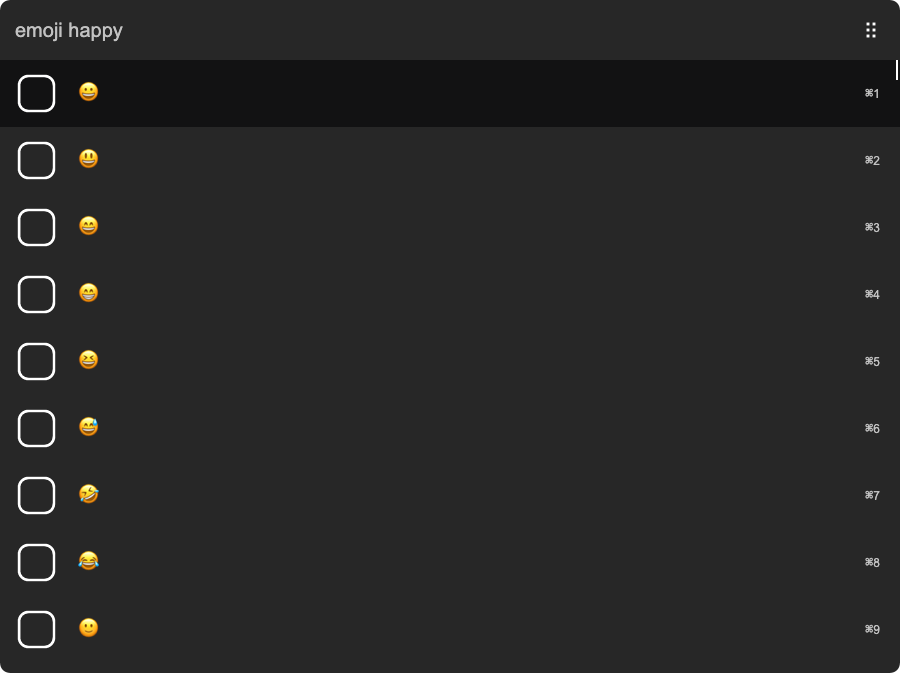

# arvis-emoj

> [Arvis](https://github.com/jopemachine/arvis) workflow to find relevant emoji from text



Uses the API from this great article on [Emoji & Deep Learning](http://getdango.com/emoji-and-deep-learning.html).<br>
Check out the [Dango app](http://getdango.com) if you want something like this on your phone.

## Install

```
$ npm install --global alfred-emoj
```

*Requires [Node.js](https://nodejs.org) 8+ and the Alfred [Powerpack](https://www.alfredapp.com/powerpack/).*

## Usage

In Alfred, type `emoj`, <kbd>Enter</kbd>, and some text, to find relevant emoji.

Select an emoji and press <kbd>Enter</kbd> to copy it to the clipboard.

When at the top, press <kbd>▲</kbd> and <kbd>Enter</kbd>, to copy all the emoji.

